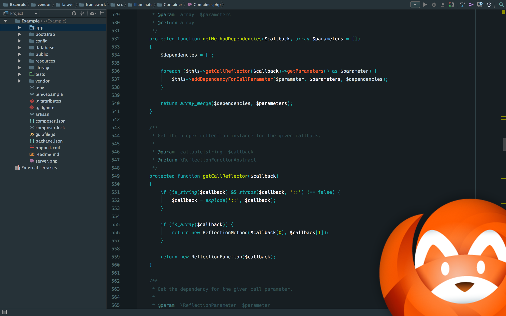

# Material Peacock
Peacock colour scheme optimized for the Material UI PHPStorm theme.

## Installation

The UI theme used in the screenshot is the Material UI theme by [Chris Magnussen](https://github.com/ChrisRM). You'll find instructions for installing it over at [his repository](https://github.com/ChrisRM/material-theme-jetbrains).

The font used in the screenshot is [Hack](https://github.com/chrissimpkins/Hack), but I'd also recommend [Fira Code](https://github.com/tonsky/FiraCode)

If you'd like to use all of my settings (more than just colours) then simply import the `settings.jar` using `File -> Import Settings`. Please note that I mostly code in PHP, so my settings will have been optimized for that environment.

If you'd like to install only the colour scheme, simply copy `Material Peacock.icls` to:

    ~/Library/Preferences/WebIde100/colors

For Linux: copy the file under the following path:

    ~/.WebIde100/config/colors
    
For windows: copy the file under the following path:

    %USERPROFILE%\.WebIde100\config\colors

The `WebIde100` section is your PHPStorm version multiplied by ten. For example, using PHPStorm 7 it would be `WebIde70`. If the `colors` directory does not exist, then simply create it.

## Feedback

If you like what you see, then please send me a tweet [@daylerees](http://twitter.com/daylerees);

If you've seen a weird colouring in the theme, then please post an issue with a screenshot and sample code.

Have a wonderful day!

Dayle.
